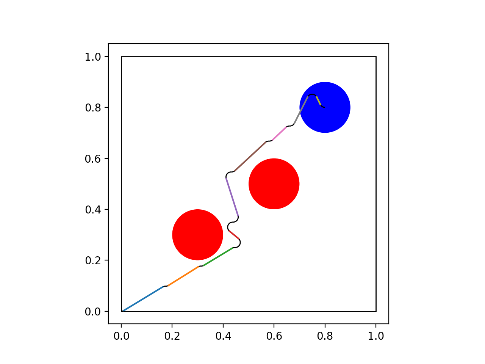
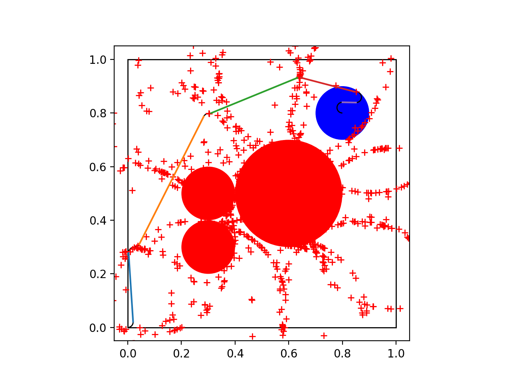
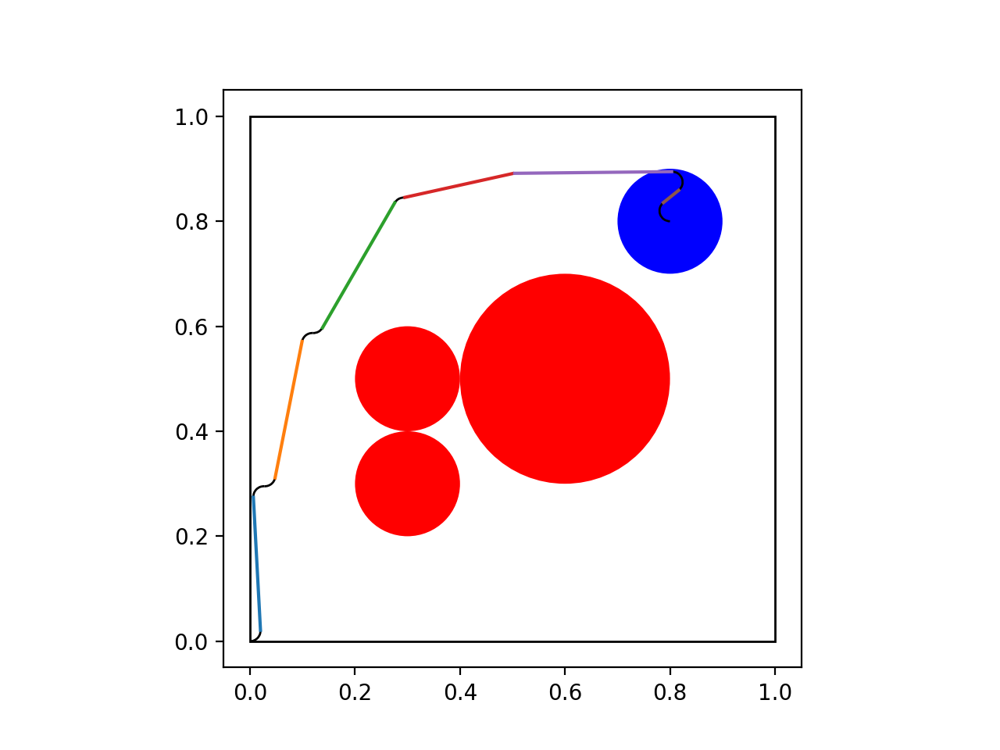

# Mobile Robots Autonomous Navigation

Implemented Dubins Curves and RRT(Rapidly Exploring Random Trees) along with the Optimal RRT version.

Simulated an environment with obstacles with a Pioneer P3DX robot in Gazebo using ROS and applied these path planning algorithms.

Refer the Project Report for more information.

# Visuals

<figure>

<figcaption>RRT Star + Dubins (Sub-Optimal) with minimized Euclidean distance between nodes, 
</figcaption>
</figure>

<figure>

<figcaption> RRT Star + Dubins with random samples, 
</figcaption>
</figure>

<figure>

<figcaption> RRT Star + Dubins (Optimal) with minimized Dubins Paths between nodes, 
</figcaption>
</figure>

 
